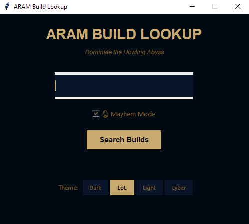

# ARAM Build Lookup

A lightweight Windows desktop app that instantly opens champion build pages for League of Legends ARAM and Arena Mayhem modes.

## Features

- Opens u.gg and metasrc builds for any champion simultaneously
- Toggle between **ARAM** and **Mayhem** mode builds
- 4 themes: League of Legends, Dark Modern, Minimal, Cyberpunk

## Requirements

- Windows (uses Chrome browser)
- Python 3
- `tkinter` (included with standard Python)

## Usage

Double-click `aram_build_lookup.exe` to launch, or run from the command line:

```bash
python aram_build_lookup.py
```

Type a champion name and press **Enter** or click **Search Builds**. Two browser tabs will open — one on u.gg and one on metasrc.

## Building the Executable

To package into a standalone `.exe` using [PyInstaller](https://pyinstaller.org):

```bash
pip install pyinstaller
pyinstaller --onefile --windowed aram_build_lookup.py
```

The executable will be in the `dist/` folder. `--windowed` prevents a console window from appearing alongside the app.



## Themes

| Theme | Description |
|-------|-------------|
| LoL | League of Legends gold & black |
| Dark | Tokyo Night-inspired dark mode |
| Light | Clean minimal white |
| Cyber | Cyberpunk neon green & pink |
